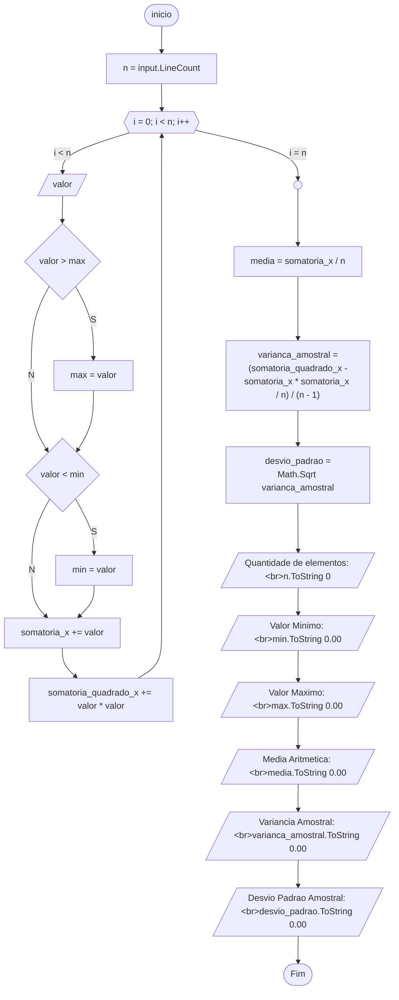

# Diagrama de Fluxo — Estatística Descritiva

```mermaid
flowchart TD
    A([inicio]) --> B[n = input.LineCount]
    B --> C{{"i = 0; i &lt; n; i++"}}
    C -->|"i &lt; n"| D[/valor/]
    D --> E{valor &gt; max}
    E -->|"S"| F[max = valor]
    E -->|"N"| G{valor &lt; min}
    F --> G
    G -->|"S"| H[min = valor]
    G -->|"N"| I[somatoria_x += valor]
    H --> I
    I --> J[somatoria_quadrado_x += valor * valor]
    J --> C
    C -->|"i = n"| K(( ))
    K --> L[media = somatoria_x / n]
    L --> M["varianca_amostral =<br>(somatoria_quadrado_x -<br>somatoria_x * somatoria_x / n) / (n - 1)"]
    M --> N["desvio_padrao =<br>Math.Sqrt varianca_amostral"]
    N --> O[/"Quantidade de elementos: "&lt;br&gt;n.ToString 0/]
    O --> P[/"Valor Minimo: "&lt;br&gt;min.ToString 0.00/]
    P --> Q[/"Valor Maximo: "&lt;br&gt;max.ToString 0.00/]
    Q --> R[/"Media Aritmetica: "&lt;br&gt;media.ToString 0.00/]
    R --> S[/"Variancia Amostral: "&lt;br&gt;varianca_amostral.ToString 0.00/]
    S --> T[/"Desvio Padrao Amostral: "&lt;br&gt;desvio_padrao.ToString 0.00/]
    T --> U([Fim])
```
